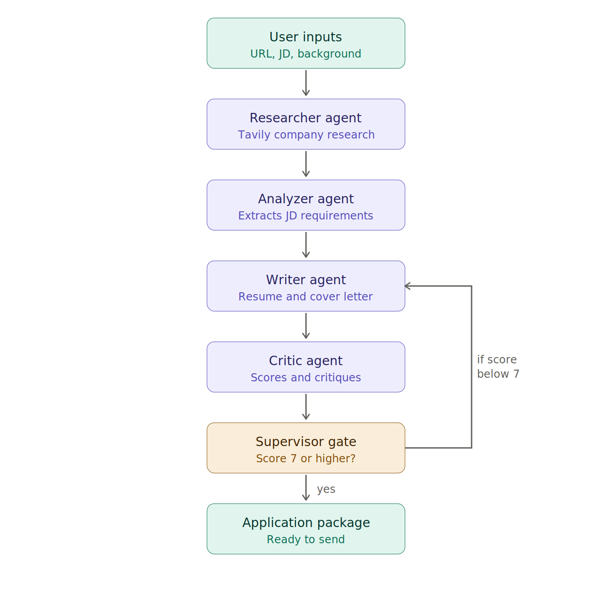

# Multi-Agent Job Application Assistant

A multi-agent system that turns a job posting and your background into a ready to send application package. Built with LangGraph using the supervisor pattern, four specialized agents collaborate to research the company, analyze the job description, write tailored resume bullets and a cover letter, then critique and refine the output until it meets a quality threshold.

**Live demo:** https://multi-agent-job-application-assistant-6fyp.onrender.com

---

## What it does

You paste a job URL, the full job description, and a short summary of your background. Four agents then work in sequence, with a supervisor deciding when the output is good enough.

1. **Researcher Agent** searches the web with Tavily for company information and recent news.
2. **Analyzer Agent** extracts the key requirements and keywords from the job description.
3. **Writer Agent** drafts tailored resume bullets and a cover letter using your background.
4. **Critic Agent** scores the output from 1 to 10, lists strengths and weaknesses, and suggests improvements.
5. **Supervisor** loops back to the Writer if the score is below 7, up to three times, then returns the final package.

---

## Architecture



```
User inputs: Job URL + Job Description + Background
        |
        v
[Researcher Agent]  searches company info and recent news (Tavily)
        |
        v
[Analyzer Agent]    extracts requirements and keywords from the JD
        |
        v
[Writer Agent]      tailors resume bullets and writes a cover letter
        |
        v
[Critic Agent]      scores the output, gives critique and suggestions
        |
        v
[Supervisor]        if score < 7 and loops < 3, send back to Writer
        |
        v
Final package: company summary + news + requirements + keywords
             + resume bullets + cover letter + critique + score
```

---

## Tech stack

| Layer | Tools |
|-------|-------|
| Orchestration | LangGraph (supervisor pattern) |
| LLM | Groq, Llama 3.3 70B |
| Web research | Tavily |
| Structured output | Pydantic with LangChain structured output |
| Backend | FastAPI |
| Observability | LangSmith tracing |
| Frontend | HTML, CSS, JavaScript, dark theme |
| Persistence | JSON history store |
| Deployment | Docker, Render |

---

## Key concepts demonstrated

- **Multi-agent communication** where agents pass shared state to each other through a typed graph
- **Supervisor pattern** where an agent decides whether the output is good enough or needs another pass
- **Conditional looping** with a loop guard to prevent infinite rewrites
- **Structured LLM output** with Pydantic models for reliable, parseable results
- **End to end tracing** across all agents with LangSmith

---

## Project structure

```
job-agent/
├── agents/
│   ├── researcher.py    company research with Tavily
│   ├── analyzer.py      requirement and keyword extraction
│   ├── writer.py        resume bullets and cover letter
│   └── critic.py        scoring, critique, suggestions
├── config.py            environment and model configuration
├── state.py             shared graph state (TypedDict)
├── graph.py             LangGraph wiring and supervisor logic
├── main.py              FastAPI app and endpoints
├── index.html           dark theme frontend
├── requirements.txt
├── Dockerfile
└── README.md
```

---

## Running locally

Clone the repo and enter the folder.

```
git clone https://github.com/Aamil-Abdulla/multi-agent-job-application-assistant.git
cd multi-agent-job-application-assistant
```

Install dependencies.

```
pip install -r requirements.txt
```

Create a `.env` file in the root with your keys.

```
GROQ_API_KEY=your_groq_key
TAVILY_KEY=your_tavily_key
LANGSMITH_KEY=your_langsmith_key
LANGCHAIN_PROJECT=job-agent
```

Start the server.

```
uvicorn main:app --reload --port 8000
```

Open http://localhost:8000 in your browser.

---

## API

### POST /generate

Generates the full application package.

Request body:

```json
{
  "job_url": "https://company.com/careers/ai-engineer",
  "job_description": "Full job description text pasted here",
  "background": "Your degree, projects, and skills"
}
```

Response returns the company summary, recent news, analyzed requirements, keywords, tailored resume bullets, cover letter, critique, score, and suggestions.

### GET /history

Returns all previously generated applications from the JSON store.

---

## Notes

- Job boards such as LinkedIn block automated scraping, so the job description is pasted directly rather than fetched from the URL. The URL is used only for company research.
- The Render free tier spins down after inactivity, so the first request after an idle period can take 40 to 60 seconds while the service wakes.

---

## Author

**Aamil Abdulla**
B.E. AI and ML, First Class with Distinction

- GitHub: https://github.com/Aamil-Abdulla
- LinkedIn: https://linkedin.com/in/aamil-abdulla-868996248
